# Employee_task_report_generator
This system generates report that gives an overview of all the employees of the company, what tasks they are doing, for how long and their contribution.

Output:

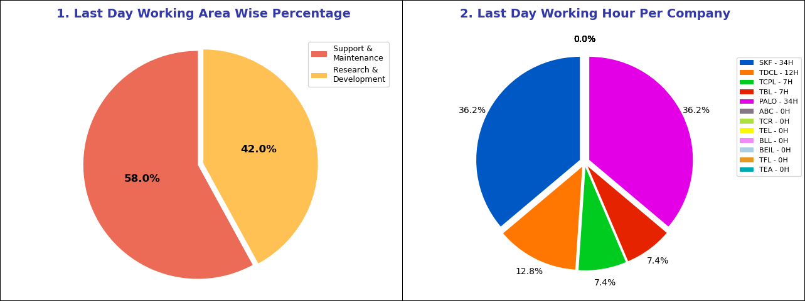
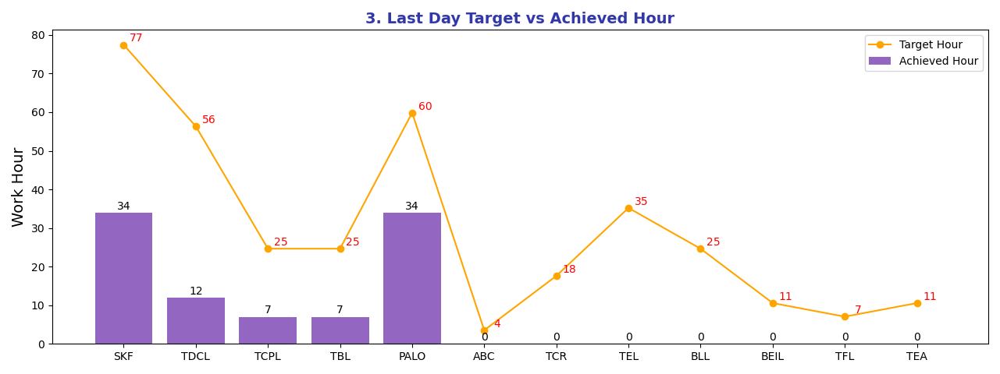
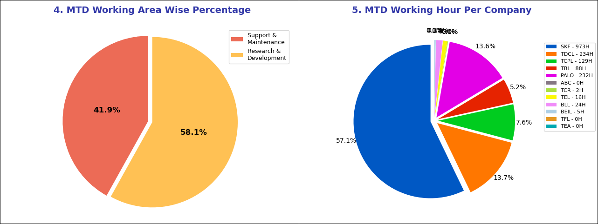
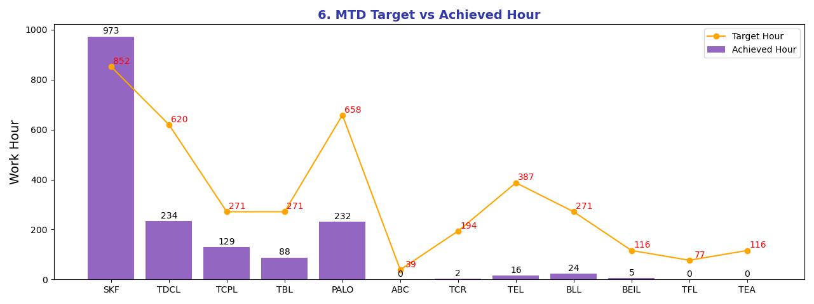
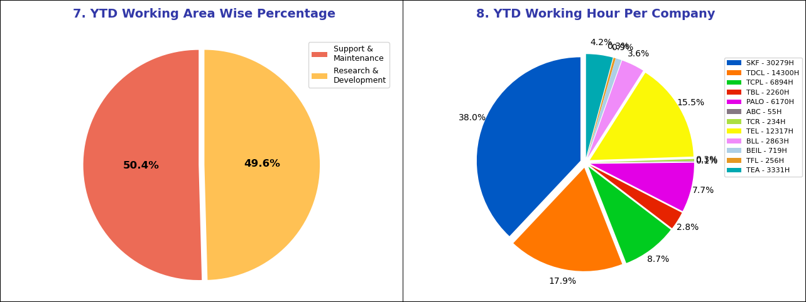
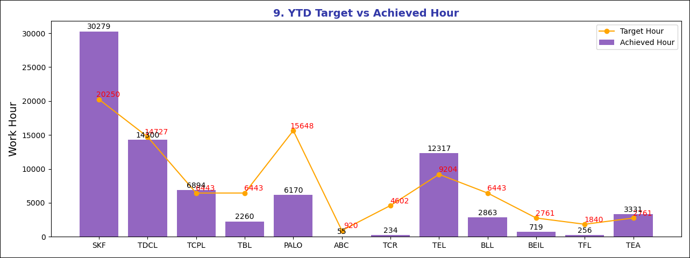
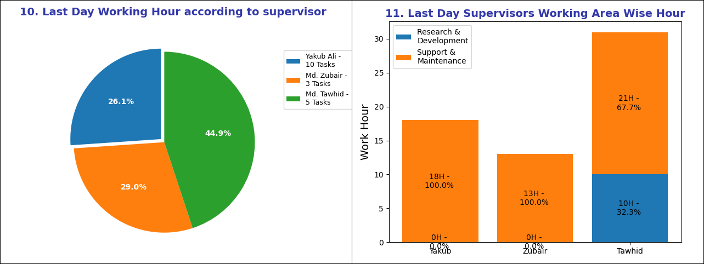
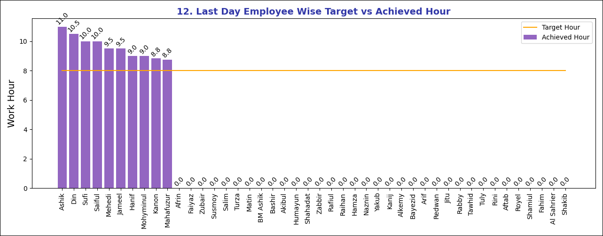
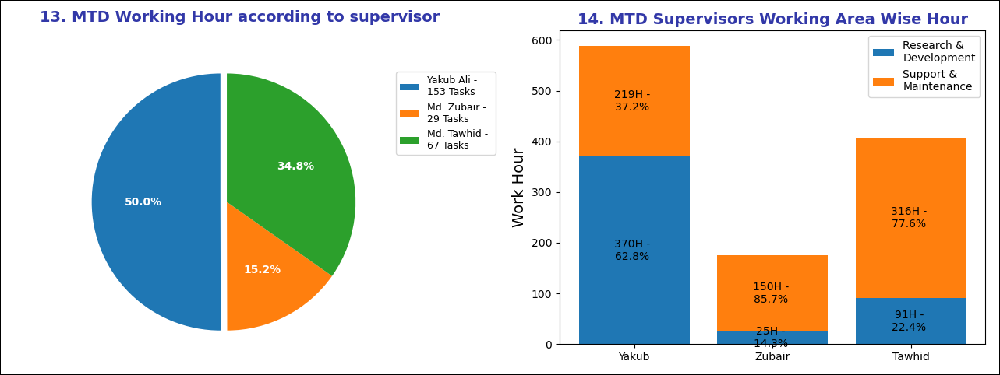
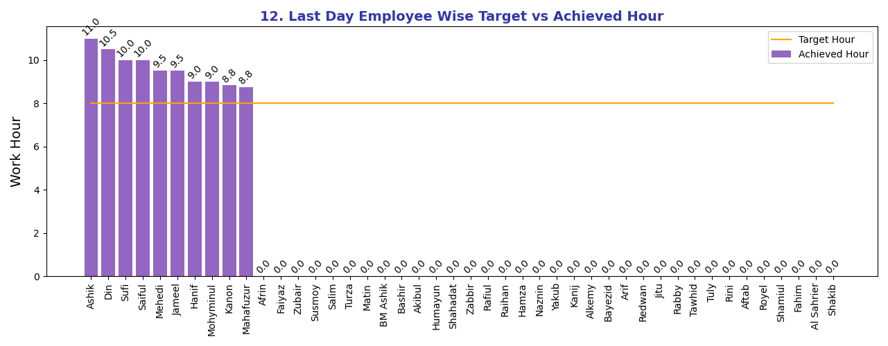
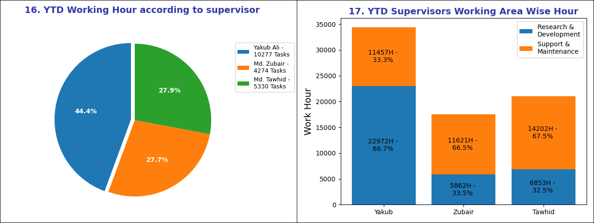
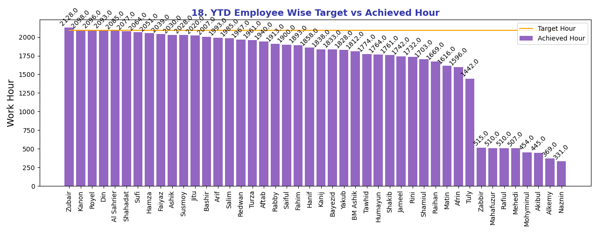
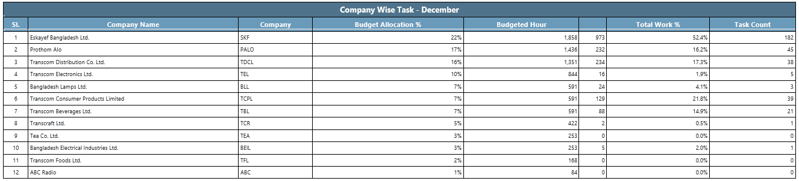
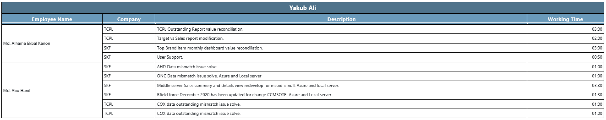
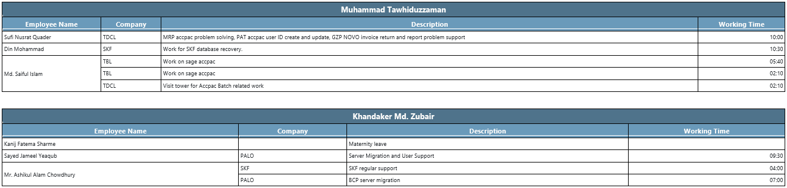
